# EduCode – AI Traffic Signs Learning App 🚦

> An Android mobile application for learning and identifying road signs, combining interactive learning modes with AI-powered real-time detection.

---

## 📱 Screenshots

<p align="center">
  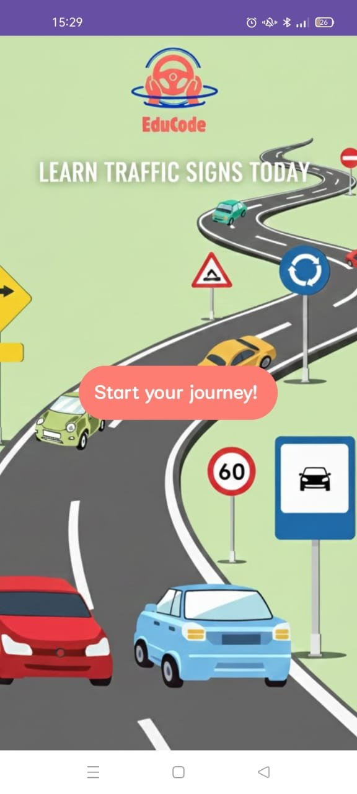
  
  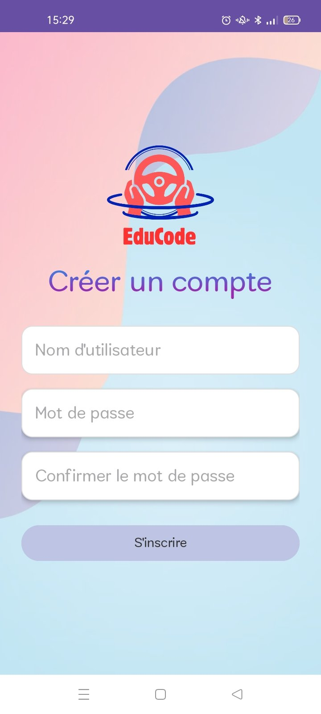
  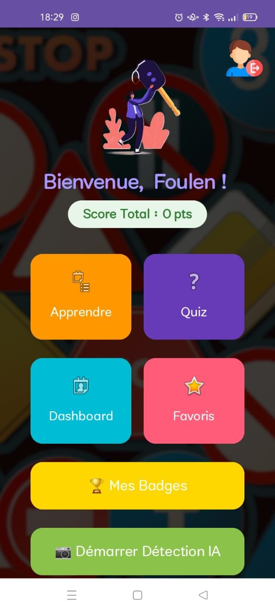
  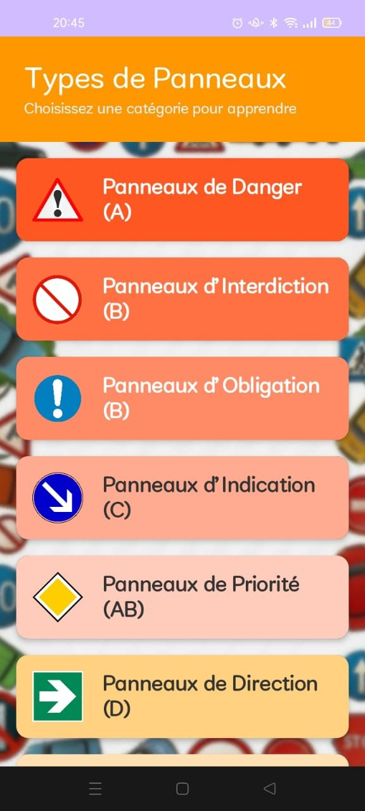
</p>
<p align="center">
  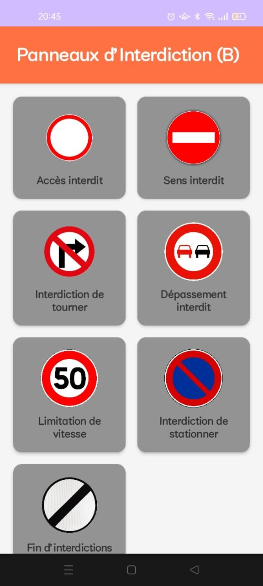
  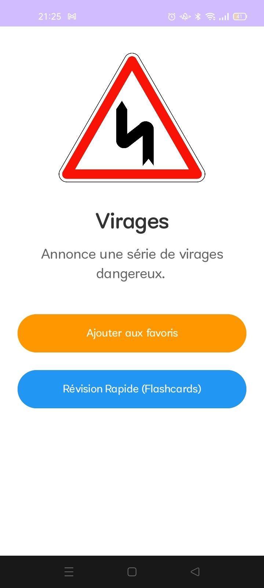
  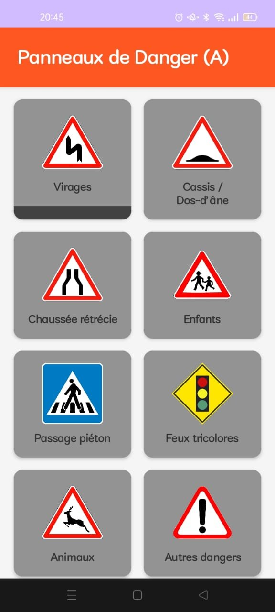
  
  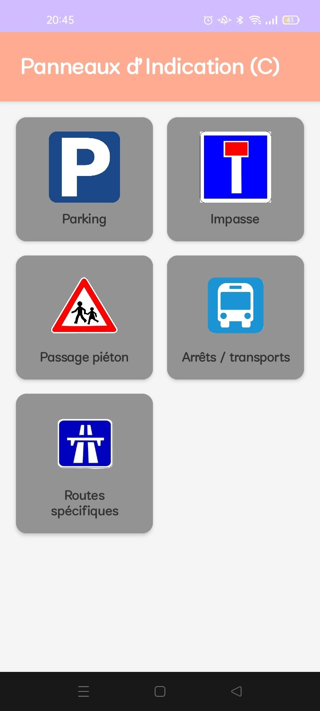
</p>
<p align="center">
  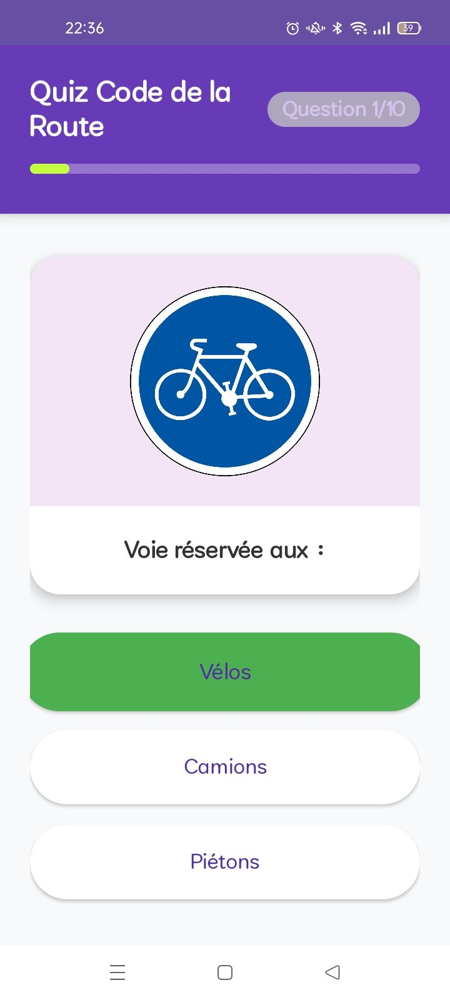
  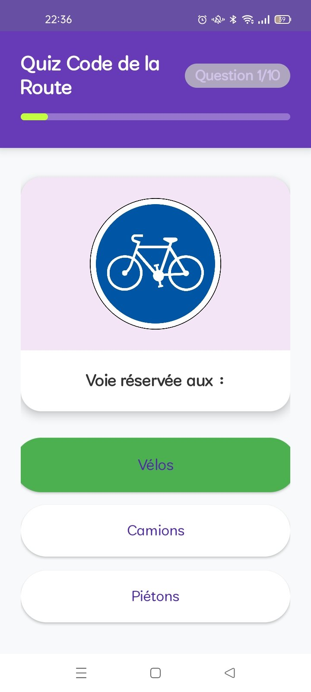
  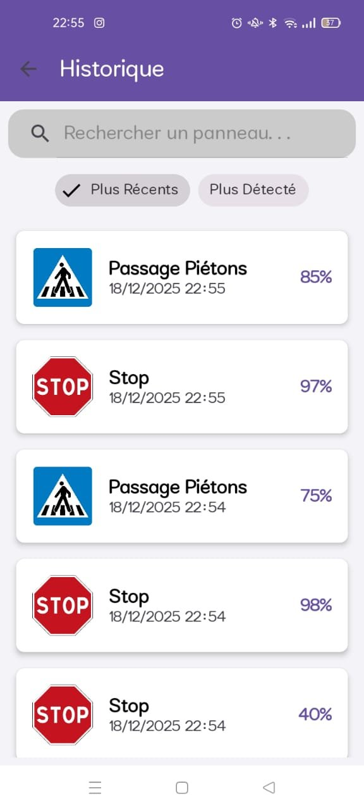
  
  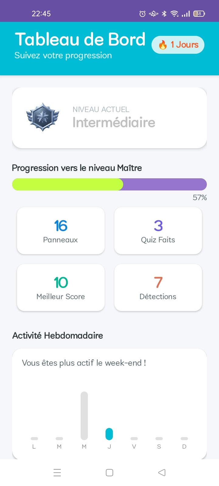
</p>

---

## 📖 Overview

**EduCode** is an Android application designed to help users prepare for the driving licence theory exam by learning road signs in an engaging, gamified way. It integrates AI-based real-time sign detection using a custom-trained Roboflow model, and stores all user data locally with SQLite.

The app is built entirely in **Java** with **Android Studio** and targets French-speaking learners (Tunisian highway code).

---

## ✨ Features

### 🎓 Learning
- Browse road signs organized by category: Danger (A), Prohibition (B), Obligation (B), Indication (C), Priority (AB), Direction (D)
- View each sign with its name and description
- Quick **Flashcard** revision mode per sign
- Save signs to a personal **Favorites** list for focused review

### 🧠 Quiz
- 10-question multiple-choice quiz with image-based questions
- Progress bar and per-question feedback (correct answer highlighted)
- Results screen with score and performance rating

### 📊 Dashboard & Gamification
- Track signs learned, quizzes completed, best score, and AI detections
- Weekly activity chart
- Daily streak counter
- "Signs to review" section highlighting frequent mistakes
- XP-based level system: **Débutant → Intermédiaire → Expert → Maître**
- Trophies unlocked at XP milestones (10 / 100 / 300 / 600 XP)

### 🤖 AI Detection
- Real-time traffic sign detection via **Roboflow** inference API
- Camera-based capture with bounding box overlay and label display
- Confidence score shown per detection
- Detected signs automatically saved to history with timestamp

### 📜 Detection History
- Full log of all AI-detected signs with confidence percentages and timestamps
- Searchable and sortable (most recent / most detected)

---

## 🛠️ Tech Stack

| Layer | Technology |
|---|---|
| Language | Java |
| Platform | Android (Android Studio) |
| Min SDK | API 26 (Android 8.0) |
| Database | SQLite (local, offline-first) |
| AI / Detection | Roboflow Inference API |
| UI | XML Layouts, custom drawables |

---

## 🗂️ Project Structure

```
EduCode/
├── app/
│   ├── src/main/
│   │   ├── java/com/example/educode/
│   │   │   ├── activities/        # All screen activities
│   │   │   ├── adapters/          # RecyclerView adapters
│   │   │   ├── models/            # Data models (Sign, User, QuizResult...)
│   │   │   ├── database/          # SQLite helper & DAOs
│   │   │   └── utils/             # Helper classes
│   │   └── res/
│   │       ├── layout/            # XML UI layouts
│   │       ├── drawable/          # Icons and sign images
│   │       └── values/            # Strings, colors, styles
│   └── build.gradle
├── screenshots/                   # App screenshots for README
└── README.md
```

---

## 🚀 Getting Started

### Prerequisites
- Android Studio (Hedgehog or later recommended)
- Android device or emulator running API 26+
- A Roboflow account and API key for the AI detection feature

### Setup

1. **Clone the repository**
   ```bash
   git clone https://github.com/YOUR_USERNAME/EduCode.git
   cd EduCode
   ```

2. **Open in Android Studio**
   - File → Open → select the `EduCode` folder

3. **Configure your Roboflow API key**
   - Locate the file where the API key is defined
   - Replace the placeholder with your own key:
     ```java
     public static final String API_KEY = "your_roboflow_api_key_here";
     ```

4. **Build and run**
   - Connect an Android device or start an emulator
   - Click **Run ▶**

> The app works fully offline except for the AI detection feature, which requires an internet connection to call the Roboflow API.

---

## 📦 Database Schema (SQLite)

| Table | Purpose |
|---|---|
| `users` | Username, hashed password, XP, streak |
| `signs` | Full sign catalog (name, category, description, image) |
| `favorites` | User-saved signs |
| `quiz_results` | Per-quiz history (score, date, category) |
| `detections` | AI detection log (label, confidence, timestamp) |

---

## 🤖 AI Model

The traffic sign detection model was trained and hosted on **[Roboflow](https://roboflow.com)**. It detects common Tunisian/French road signs in real time from camera input and returns:
- Detected class label (sign name)
- Bounding box coordinates
- Confidence score (%)

---

## 👩‍💻 Author

**Lyna** — Computer Science student  
Built as a personal Android project

---

## 📄 License

This project is open source and available under the [MIT License](LICENSE).
